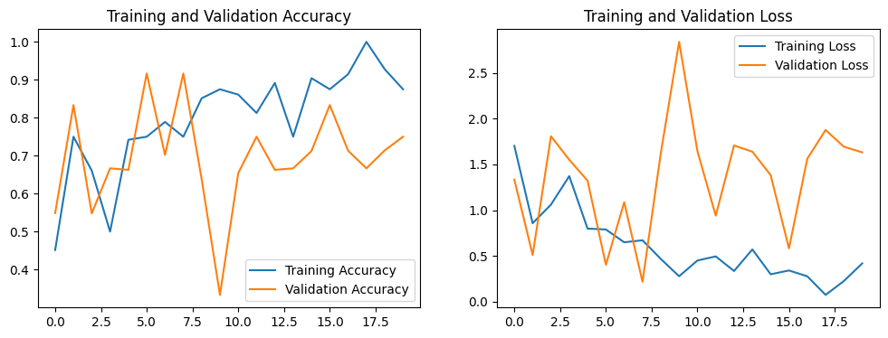
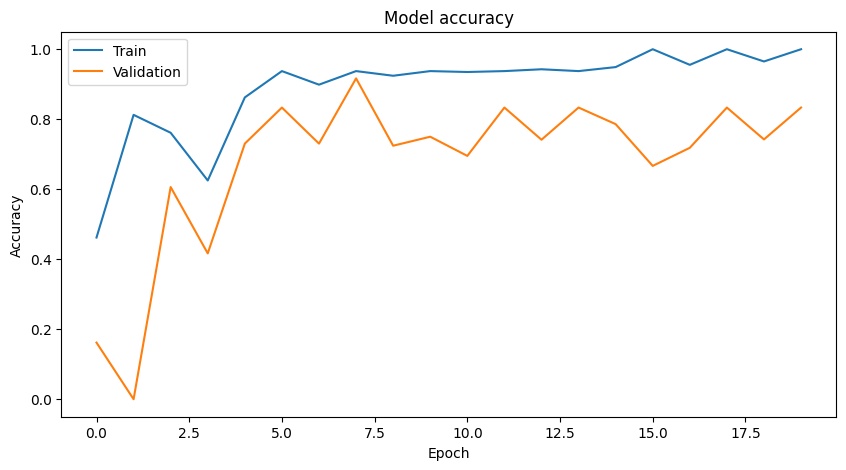
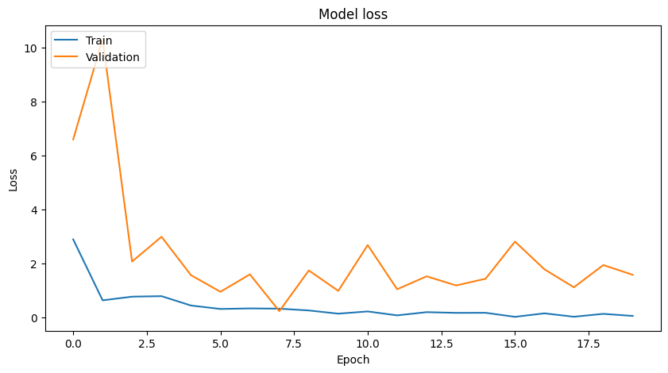

# Klasifikasi Motif Batik dengan Model VGG dan ResNet

## Deskripsi Proyek

Proyek ini bertujuan untuk mengklasifikasikan motif batik menggunakan dua model deep learning populer, yaitu **VGG** dan **ResNet**. Dalam penelitian ini, kami mengevaluasi performa kedua model untuk menentukan model mana yang lebih efektif dalam mengenali pola-pola unik dari motif batik. Hasil dari proyek ini dapat menjadi referensi untuk pengembangan aplikasi berbasis kecerdasan buatan dalam pelestarian budaya dan pengolahan data visual batik.

## Langkah Instalasi

### Prasyarat
Sebelum memulai, pastikan Anda memiliki:
- Python versi 3.8 atau lebih baru
- `pip` untuk menginstal dependencies

### Cara Instalasi
1. Clone repository ini:
   ```bash
   git clone https://github.com/username/batik-classification.git
   cd batik-classification
   ```

2. Buat lingkungan virtual (opsional tetapi disarankan):
   ```bash
   python -m venv venv
   source venv/bin/activate # Untuk macOS/Linux
   venv\Scripts\activate   # Untuk Windows
   ```

3. Instal dependencies:
   ```bash
   pip install -r requirements.txt
   ```

4. Jalankan aplikasi web:
   ```bash
   streamlit run app.py
   ```
   Aplikasi akan berjalan di `http://localhost:8501`.

## Deskripsi Model

### Model VGG
**VGG (Visual Geometry Group)** adalah model deep learning berbasis Convolutional Neural Network (CNN) yang dikenal dengan arsitekturnya yang dalam dan bertumpuk secara konsisten. Model ini terkenal dalam tugas pengenalan gambar karena kemampuannya untuk menangkap detail visual dari sebuah gambar.

### Model ResNet
**ResNet (Residual Network)** adalah model CNN yang diperkuat dengan residual learning. Dengan memanfaatkan shortcut connections, ResNet mengatasi masalah degradasi performa pada jaringan yang sangat dalam. Model ini unggul dalam menangani data visual yang kompleks dan beragam seperti motif batik.

### Analisis Performa
Kedua model dievaluasi menggunakan metrik berikut:
- **Akurasi**
- **Loss**
- **Precision, Recall, dan F1-Score (opsional)**

Visualisasi performa akan ditampilkan dalam bentuk grafik akurasi dan loss selama pelatihan dan validasi.

## Sumber Dataset
Dataset yang digunakan dalam proyek ini berasal dari [Kaggle - Batik Daerah Indonesia](https://www.kaggle.com/datasets/robbybirham/batik-daerah-indonesia). Dataset ini menyediakan berbagai gambar motif batik dari berbagai daerah di Indonesia, sehingga cocok untuk tugas klasifikasi visual.

## Hasil dan Analisis

### Hasil Perbandingan
- **Akurasi:**
  - VGG: 68%
  - ResNet: 75%
- **Loss:**
  - VGG: 2.9919
  - ResNet: 1.9548

### Visualisasi Hasil
Pada aplikasi, Anda akan menemukan grafik akurasi dan loss berikut:
- Grafik  **VGG** (accuracy dan loss).



- Grafik  **VGG** (accuracy dan loss).




### Kesimpulan
- ResNet unggul dibandingkan VGG dalam akurasi:
Akurasi ResNet lebih tinggi (75%) dibandingkan VGG (68%), menunjukkan bahwa ResNet mampu memprediksi lebih banyak data dengan benar.

- Loss ResNet lebih rendah dibandingkan VGG:
Loss ResNet (1.9548) lebih kecil daripada VGG (2.9919), yang menunjukkan bahwa ResNet menghasilkan prediksi yang lebih dekat ke target sebenarnya.

- Kesimpulan Umum
ResNet lebih baik daripada VGG pada tugas ini, baik dari segi akurasi maupun loss. Ini mencerminkan bahwa ResNet, dengan arsitekturnya yang lebih modern (termasuk residual connections), lebih mampu menangkap pola pada data dibandingkan VGG.
## Link Live Demo
[Aplikasi Web Live Demo](https://klasifikasi-motif-batik-indonesia.streamlit.app)

---

Harap memastikan bahwa dataset motif batik telah dipersiapkan dan tersedia dalam format yang kompatibel dengan aplikasi ini. Semua kode dapat diakses di repository ini dan bebas dimodifikasi sesuai kebutuhan.

